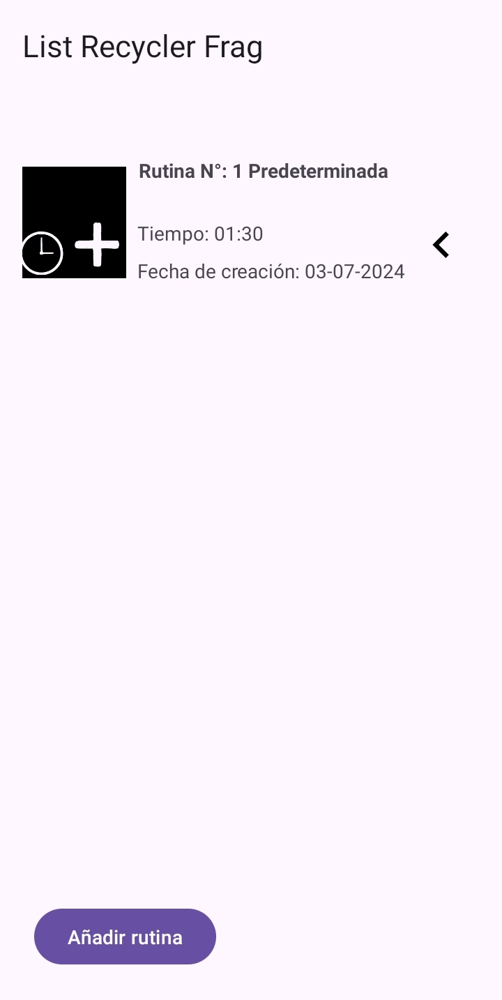

# Proyecto Personal Training
Aplicacion de ejercicios para android donde puedes armar tus propias rutinas a tu gusto con imagenes cargadas directo de tu celular para tener tanta informacion como gustes.  

  
Puedes ver el nombre de la rutina, el tiempo que tomaria la rutina y la fecha de creacion.  
  
## Control para las rutinas
  
Control que arrastar para ver los botones  
- Play: Permite empezar el cronometro de la rutina.
- Edit: Permite editar los ejercicios de una rutina
- Delete: Borra la rutina y todo su contenido 

## Iniciando Rutina
 
- *Botones*
  - Pausa : Permite pausar el ejercicio
  - Boton < (previous button) : Moverte al ejercicio anterio.
  - Boton > (next button) : Moverte al siguiente ejercicio
  - Boton +5 : Agrega 5 segundos a al ejercicio
- *Etapas*
  - Preparacion : 10 segundos antes de comenzar e incluye el ejercicio a continuacion.
  - Ejercicio : Comienza el ejercicio con el tiempo que introduciste con fotos que agregaste.
  - Descanso : Momento de descanso y una vista previa del siguiente ejercicio.
  - Resultados: Felicitaciones por tu esfuerzo y el tiempo que duraste en la rutina.

## Editando rutina
   
Puedes editar el nombre de la rutina  
Al tocar el ejercicio puedes:  
- Selecciona ejercicio
  - Agregar imagenes
  - Reemplazar imagen
  - Borrar imagen
  - Borrar todas las imagenes del ejercicio
  - Editar el nombre del ejercicio
  - Cambiar los tiempos del ejercicio y descanso
  - Activar o desactivar los objetivos
- Copiar
  - Es para obtener la informacion de ese ejercicio y crear uno nuevo en base a ese.
- Duplicar 
  - Permite crear un ejercicio exactamente igual de manera rapida
- Eliminar
  - Borra el ejercicio y sus imagenes

## Agregando 
   
1. Colocas el nombre de la rutina.
2. Pones el nombre del ejercicio
3. Seleccionas si quieres las repeticiones, para que tengas un objetivo en cada ejercicio y no sea solo tiempo.
4. Si no, tambien puedes dejarlo con solo tiempo. 
5. Coloca el tiempo del ejercicio y descanso en formato MM:SS, ejemplo, 01:23 o 1:1 o 2:01 .
6. Guardas el ejercicio y repites hasta completar tu rutina.
7. Puedes copiar, duplicar y eliminar pulsando sobre el ejercicio que deseas aplicar. 

## Eliminando
     
Finalmente borrando la rutina, si no te gusta, borrala.